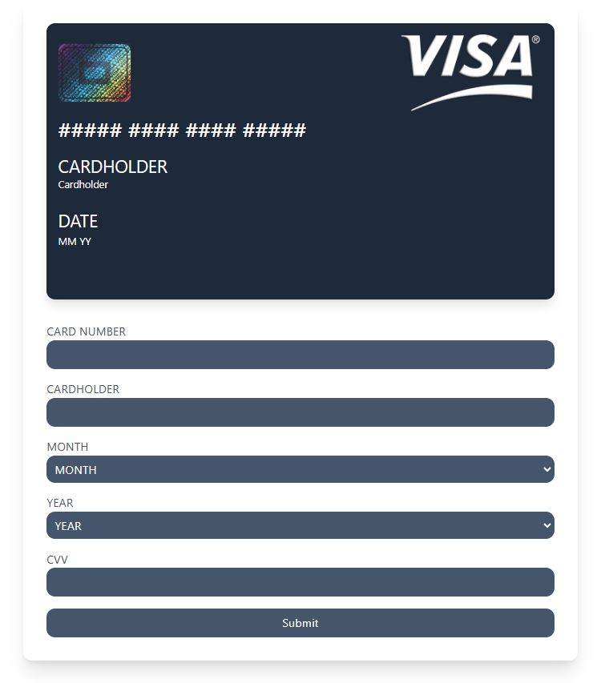

# 💳 Credit Card UI  

Bu proje, **HTML, TailwindCSS ve JavaScript** kullanarak oluşturulmuş **interaktif bir kredi kartı tasarımıdır.**  
Kullanıcı, kart numarası, isim, son kullanım tarihi ve CVV bilgilerini girdiğinde, bilgiler anında kartın üzerine yansıtılır.  

---

## 🚀 Özellikler  
✅ **Gerçekçi kredi kartı tasarımı**  
✅ **Kart bilgileri canlı olarak güncelleniyor**  
✅ **Kart numarası otomatik olarak `#### #### #### ####` formatına dönüştürülüyor**  
✅ **CVV alanına odaklanıldığında kart arka yüzüne dönüyor**  
✅ **Temiz ve modüler kod yapısı**  

---

## 📌 Kullanılan Teknolojiler  
- **HTML**  
- **TailwindCSS**  
- **JavaScript (ES6+)**  

---

## 🛠️ Kurulum ve Kullanım  
📌 **Projeyi klonla ve çalıştır:**  
```sh
git clone https://github.com/enginyz/credit-card-project.git
cd credit-card-project
```   

✅ Daha sonra index.html dosyasını açarak projeyi çalıştırabilirsin!   

## 📷 Ekran Görüntüsü    

   

## 🤝 Katkıda Bulun   
🚀 Projeye katkıda bulunmak istersen pull request gönderebilirsin!   
🌟 Eğer projeyi beğendiysen, GitHub’da ⭐ vererek destek olabilirsin!   